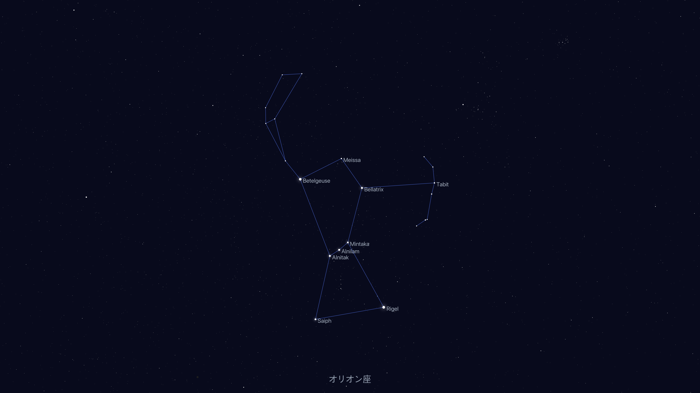
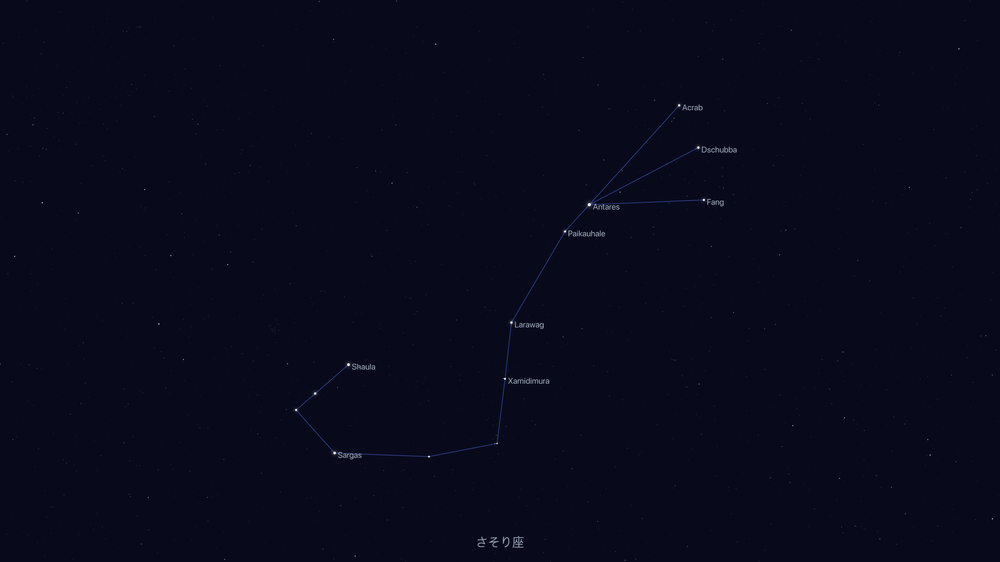
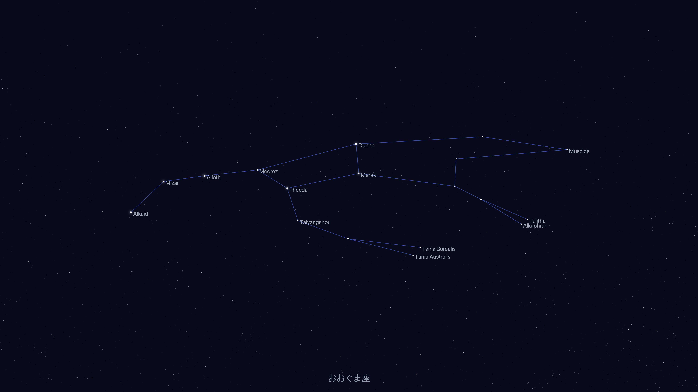
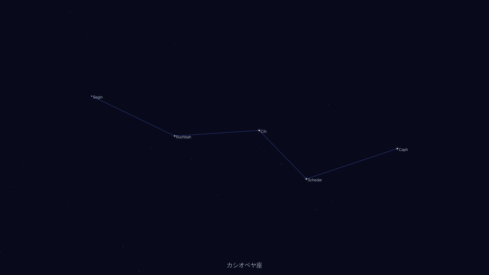

# 星座デスクトップ

## 背景

プラネタリウムに行くと星座のことは教えてもらえるが、その後、暮らしに密着したい。
二つの仮説がある。
まず、星座を頭に入れることで人生が豊かになるという仮説。たとえば、サイゼリヤの青豆のサラダが何粒か残ったときに同じ形の星座を思い出すなど。
それから、頭に入らないのは単純に目にする機会が少ないからであり、スクリーンセーバーなどで目にしておけば頭に入るという仮説。

## このプロジェクトでやりたいこと
- 星座を頭に入れるためのデスクトップ画像を作成
- 画像は何パターンか用意し、星の配置だけのもの、星座名ありのもの、など
- 星の名前も可能なら配置したい

## 生成例

| オリオン座 | さそり座 |
|:---:|:---:|
|  |  |

| おおぐま座 | カシオペヤ座 |
|:---:|:---:|
|  |  |

## セットアップ

Go 1.26以上が必要。

```sh
# データダウンロード → ビルド → 画像生成 → ~/Pictures/星座/ にコピー
make publish
```

### 個別コマンド

```sh
make data      # HYG Database と Stellarium 星座線データをダウンロード
make build     # バイナリビルド
make run       # ビルド＆画像生成（output/ に出力）
make publish   # run + ~/Pictures/星座/ にコピー
make clean     # バイナリと output/ を削除
```

### データソース

- 星データ: [HYG Database](https://github.com/astronexus/HYG-Database) (約12万星の位置・等級・固有名)
- 星座線: [Stellarium](https://github.com/Stellarium/stellarium) の modern sky culture (88星座の結線データ)

`make data` で `data/` ディレクトリに自動ダウンロードされる。

### スクリーンセーバーとして使う

`make publish` 後、macOSのシステム設定 → スクリーンセーバー で `~/Pictures/星座/` フォルダを指定する。

## 技術メモ

- 出力解像度: 5120x2880 (5K Retina)
- 赤経・赤緯をそのまま平面投影（0hをまたぐ星座は折り返し処理あり）
- 星の描画: グレースケール、明るい星にはガウシアングロー
- 描画ライブラリ: [fogleman/gg](https://github.com/fogleman/gg)